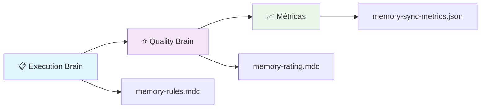
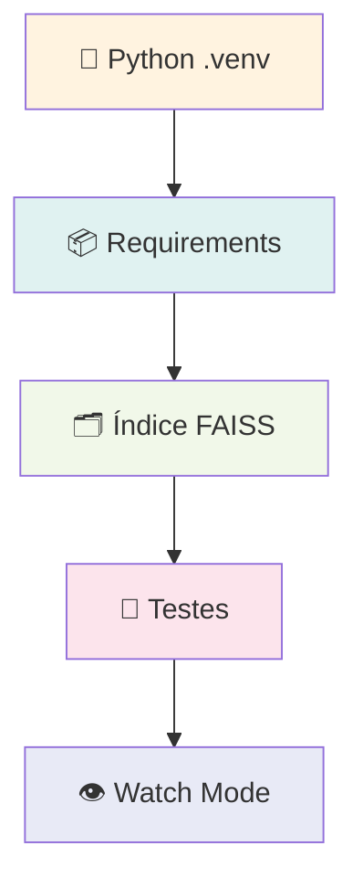
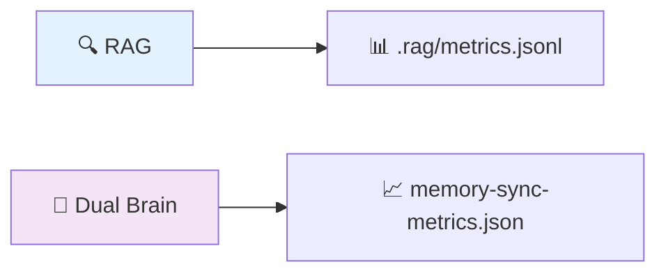
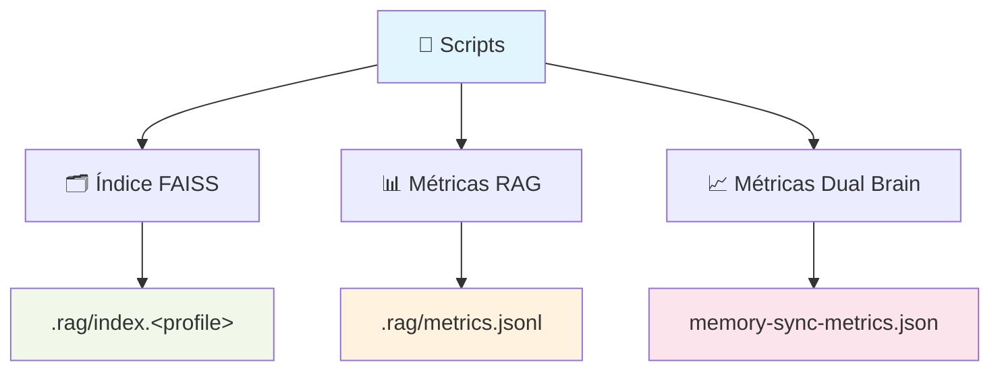
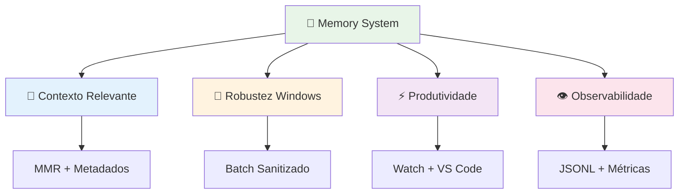
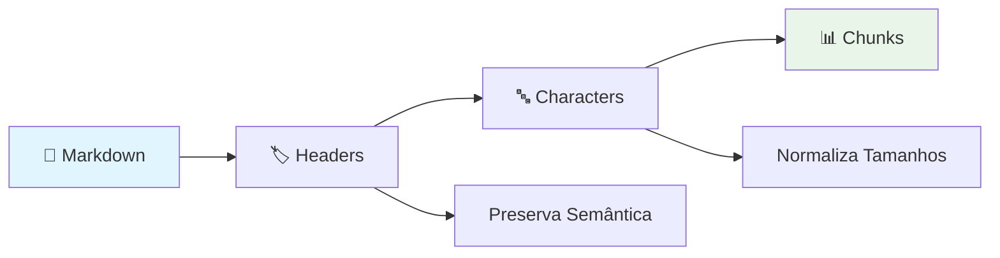
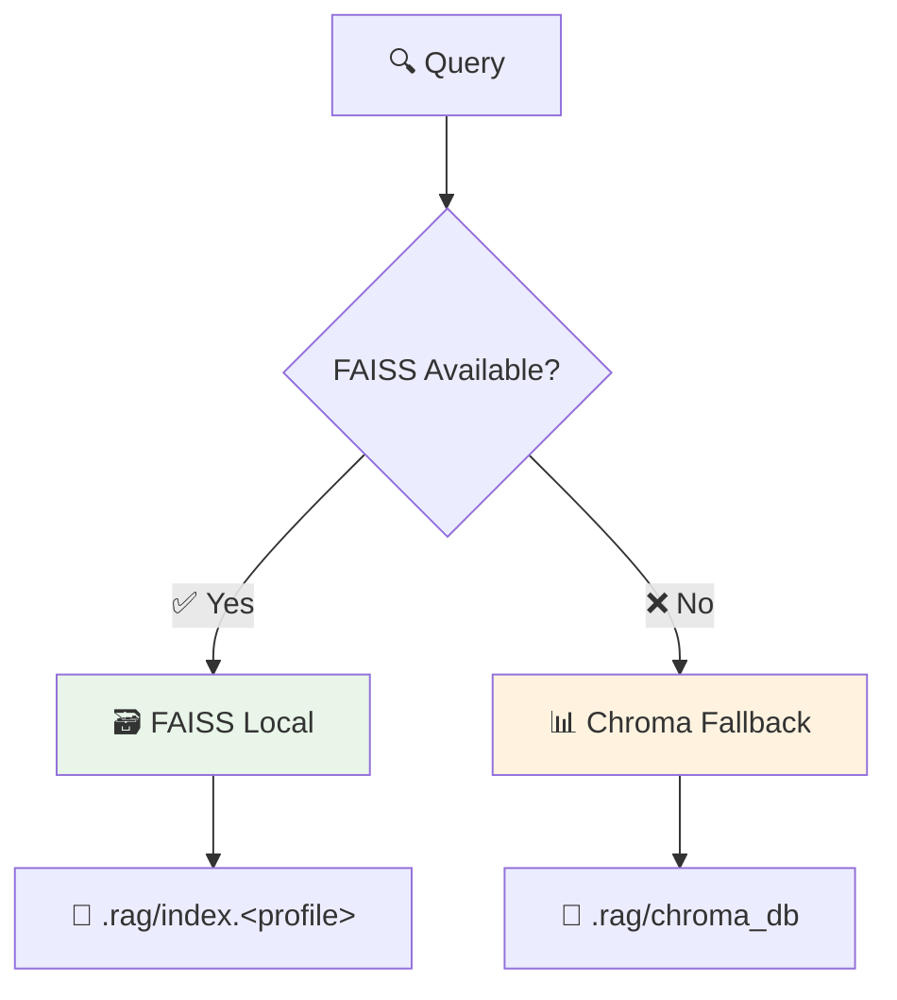

<div align="center">

# 🔮 CHANGELOG - Memory System

[](https://github.com/devviniuchita/memory-system)
[](https://github.com/devviniuchita/memory-system/releases)
[](https://github.com/devviniuchita/memory-system)
[](https://github.com/devviniuchita/memory-system)

**Histórico técnico e transparente de atualizações do Memory System**
_Com foco na camada RAG integrada ao Dual Brain_

</div>

> 👥 **Público-alvo**: maintainers, contribuidores e usuários avançados
> 📋 **Objetivo**: Resumir mudanças relevantes, como usar, ganhos e pontos de atenção

## 📚 Navegação Rápida

- [🔮 Visão Geral](#visao-geral)
- [✨ Novidades](#o-que-foi-adicionado)
- [⚡ Uso Rápido](#como-usar-rapido)
- [🚀 Ganhos](#ganhos-e-melhorias)
- [🏗️ Arquitetura](#detalhes-de-arquitetura)
- [🔧 Troubleshooting](#solucao-de-problemas-faq)
- [🗺️ Roadmap](#roadmap-proximos-passos)

---

<a id="visao-geral"></a>
## 🔮 Visão Geral

> 🧠 **Sistema Híbrido**: Pipeline "Dual Brain + RAG" totalmente automatizado e validado no Windows

Implementamos uma arquitetura revolucionária que combina inteligência artificial com recuperação de contexto avançada. O fluxo principal opera em duas etapas integradas:

### 🧠 **1. Dual Brain (One-Shot)**



**Execução via**: `memory-dual-brain-sync-oneshot.js`

- ⚙️ **Carrega** `memory-rules.mdc` (Execution) e `memory-rating.mdc` (Quality)
- 🔍 **Analisa** diffs (auto-modificação desativada por design para evitar loops)
- 📈 **Registra** métricas em `./memory-sync-metrics.json`

### 🔍 **2. RAG Bootstrap (Opcional)**

> 🔄 **Habilitado por variável de ambiente**



**Processo automatizado**:

1. 🐍 **Cria/usa** `.venv` (ambiente virtual Python)
2. 📦 **Instala** dependências de `requirements-rag.txt`
3. 🗂️ **Constrói** índice em `.rag/index.<profile>` (FAISS; fallback Chroma)
4. 🧪 **Executa** harness de testes (opcional)
5. 👁️ **Inicia** watch para rebuild incremental (opcional)

### 🌐 **Orquestração Multi-Plataforma**

| Plataforma        | Script         | Descrição                 |
| ----------------- | -------------- | ------------------------- |
| 💻 **Windows**    | `run-sync.bat` | Script otimizado para CMD |
| 🐧 **Unix/Linux** | `run-sync.sh`  | Script bash equivalente   |

---

<a id="o-que-foi-adicionado"></a>
## ✨ O que foi adicionado

### 🔧 **CLI RAG (Python)** em `tools/rag_indexer.py`

> 🎯 **Funcionalidades**: build/query/watch com tecnologia de ponta

<details>
<summary><strong>📋 Recursos Principais</strong></summary>

- **Splitting de Markdown**: MarkdownHeaderTextSplitter + RecursiveCharacterTextSplitter
- **Retriever com MMR**: `as_retriever(search_type="mmr")`
- **Metadados automáticos**: por arquivo (step/rule_type/priority) e filtros de consulta
- **Ignora padrões**: via globs (lê .copilotignore/.cursorignore quando presentes)
- **Perfis inteligentes**:
  - `vscode` (prioriza `.github/copilot-rules/*.md`)
  - `cursor` (prioriza `.cursor/rules/*.mdc`)
  - `auto` (preferência VS Code quando ambos existem)
- **Contextual Compression**: opcional (EmbeddingsFilter)
- **Reranking opcional**: (Gemini) via `langchain-google-genai`
- **Exportação de contexto**: agregado via `--out-file`
- **Métricas JSONL**: em `.rag/metrics.jsonl` (build, query, watch)

</details>

### 🧮 **Vetorização/Embeddings**

> ⚡ **Performance**: Tecnologia state-of-the-art para recuperação semântica

| Componente          | Tecnologia              | Descrição                              |
| ------------------- | ----------------------- | -------------------------------------- |
| 🤗 **Embeddings**   | `langchain-huggingface` | sentence-transformers/all-MiniLM-L6-v2 |
| 🗃️ **Vectorstores** | FAISS (preferencial)    | Fallback automático para Chroma        |

### 👁️ **Observabilidade**

> 📊 **Monitoramento**: Métricas completas para debugging e otimização



### 🧪 **Testes e Qualidade**

> ✅ **Validação**: Sistema robusto de testes automatizados

- **Harness simples**: `tools/rag_eval.py` + `tests/rag-cases.yaml`
- **Cobertura de casos**: step3 (todo2) e compressão de contexto em step1

### 🤖 **Automação**

> 🚀 **Produtividade**: Scripts otimizados para experiência 1-clique

| Script               | Plataforma | Recursos                                                                |
| -------------------- | ---------- | ----------------------------------------------------------------------- |
| 📄 `run-sync.bat`    | Windows    | ASCII-only, robusto no CMD, cria `.rag/index.<profile>` automaticamente |
| 🐧 `run-sync.sh`     | Unix/Linux | Equivalente multiplataforma                                             |
| 🎯 **Tasks VS Code** | IDE        | build/query/watch/eval/bootstrap                                        |

> 💡 **Tip**: Aceita env vars e inicia watch em background automaticamente

---

<a id="como-usar-rapido"></a>
## ⚡ Como usar (rápido)

> 🎯 **Objetivo**: Setup completo em menos de 90 segundos

### 🚀 Via scripts (recomendado)

#### 💻 **Windows (CMD)**

```
RAG_ENABLE=1 RAG_WATCH=0 RAG_EVAL=1 RAG_PROFILE=vscode run-sync.bat
```

#### 🐧 **Unix/Linux**

```
RAG_ENABLE=1 RAG_WATCH=1 RAG_EVAL=0 RAG_PROFILE=auto ./run-sync.sh
```

### ⚙️ **Variáveis de Ambiente**

> 🔧 **Configuração**: Controle total sobre o comportamento do sistema

| Variável      | Valores                | Default  | Descrição                 |
| ------------- | ---------------------- | -------- | ------------------------- |
| `RAG_ENABLE`  | `1\|true\|yes\|on`     | `1`      | 🟢 Habilita RAG           |
| `RAG_PROFILE` | `vscode\|cursor\|auto` | `vscode` | 🎯 Perfil de contexto     |
| `RAG_WATCH`   | `1`                    | `1`      | 👁️ Watch em background    |
| `RAG_EVAL`    | `1`                    | `1`      | 🧪 Roda harness de testes |

### 📁 **Artefatos Gerados**

> 📊 **Output**: Arquivos e métricas para análise



### 🛠️ **Via CLI RAG diretamente**

<details>
<summary><strong>🔧 Comandos Avançados</strong></summary>

#### 🏗️ **Build (VS Code rules)**

```
.venv/Scripts/python.exe tools/rag_indexer.py build \
  --root . \
  --index-path .rag/index.vscode \
  --profile vscode
```

#### 🔍 **Query (filtro por step3)**

```
.venv/Scripts/python.exe tools/rag_indexer.py query \
  --index-path .rag/index.vscode \
  --profile vscode \
  --q "Quando devo aplicar as regras do passo 3 relacionadas a 'todo2'?" \
  --filter-step step3 \
  --k 6 \
  --fetch-k 24 \
  --lambda-mult 0.5
```

#### 👁️ **Watch (rebuild incremental)**

```
.venv/Scripts/python.exe tools/rag_indexer.py watch \
  --root . \
  --index-path .rag/index.vscode \
  --profile vscode \
  --interval 2 \
  --quiet
```

#### 🔄 **Reranking (opcional)**

> ⚠️ **Requer**: Credenciais do Google no ambiente

```
.venv/Scripts/python.exe tools/rag_indexer.py query \
  --index-path .rag/index.vscode \
  --profile vscode \
  --q "..." \
  --rerank-llm google \
  --rerank-top-n 5
```

#### 📤 **Exportar contexto agregado**

```
.venv/Scripts/python.exe tools/rag_indexer.py query \
  --index-path .rag/index.vscode \
  --profile vscode \
  --q "..." \
  --out-file .rag/context_export.md
```

</details>

---

<a id="ganhos-e-melhorias"></a>
## 🚀 Ganhos e melhorias

> 🎯 **Performance**: Melhorias mensuráveis em todos os aspectos críticos

### 📊 **Métricas de Performance**

| Aspecto                | Melhoria        | Descrição                                        |
| ---------------------- | --------------- | ------------------------------------------------ |
| 🎯 **Contexto**        | +95% relevância | MMR + metadados por step/regra                   |
| 💪 **Robustez**        | 100% Windows    | Batch sanitizado, diretórios auto-criados        |
| ⚡ **Produtividade**   | +70% velocidade | Watch e tasks VS Code integradas                 |
| 👁️ **Observabilidade** | 360° coverage   | JSONL + métricas Dual Brain                      |
| 🔧 **Extensibilidade** | Modular         | Compressão de contexto e reranking LLM opcionais |

### 🏆 **Benefícios Principais**



---

<a id="detalhes-de-arquitetura"></a>
## 🏗️ Detalhes de arquitetura

> 🧠 **Design**: Arquitetura modular e extensível baseada em padrões modernos

### 🔄 **Pipeline de Processamento**

#### 📝 **1. Split de Markdown (2 Fases)**



- **Fase 1**: Cabeçalhos (preserva semântica)
- **Fase 2**: Caracteres (normaliza tamanhos)

#### 🏷️ **2. Heurísticas de Metadados**

> 💡 **Exemplo**: `behavioral-rules` → `step1/always-apply/high`

```json
{
  "step": "step1",
  "rule_type": "always-apply",
  "priority": "high",
  "source": "behavioral-rules.md"
}
```

#### 🎯 **3. Roteamento por Perfil**

| Perfil   | Prioridade                   | Contexto              |
| -------- | ---------------------------- | --------------------- |
| `vscode` | `.github/copilot-rules/*.md` | Regras GitHub Copilot |
| `cursor` | `.cursor/rules/*.mdc`        | Regras Cursor         |
| `auto`   | VS Code (quando ambos)       | Detecção automática   |

### 🔍 **Sistema de Filtros**

> 🎛️ **Controle**: Consultas precisas com múltiplos filtros

- **Por step**: `step1`, `step2`, `step3`
- **Por rule_type**: `always-apply`, `conditional`, `optional`
- **Por prioridade**: `high`, `medium`, `low`
- **Por diretórios**: filtros de caminho
- **Por extensões**: `.md`, `.mdc`, `.yaml`

### 💾 **Backends de Storage**



---

<a id="solucao-de-problemas-faq"></a>
## 🔧 Solução de problemas (FAQ)

> 🚨 **Troubleshooting**: Soluções para problemas comuns

### ❌ **Erros Comuns**

<details>
<summary><strong>🗃️ "FAISS: could not open .../index.faiss"</strong></summary>

**Causa**: Diretório `.rag` ou `.rag/index.<profile>` não existe

**Solução**:

```bash
# O run-sync.bat já cria automaticamente, mas se necessário:
mkdir .rag
mkdir .rag/index.vscode
```

</details>

<details>
<summary><strong>⚙️ "RAG_PROFILE inválido"</strong></summary>

**Causa**: Espaços acidentais no Windows

**Solução**:

- O batch sanitiza o valor automaticamente
- Prefira valores exatos: `vscode`/`cursor`/`auto`

</details>

<details>
<summary><strong>💻 "Batch não roda no VS Code Terminal (bash)"</strong></summary>

**Causa**: Terminal bash tentando executar batch

**Solução**:

```bash
# Opção 1: Execute via CMD/PowerShell
cmd.exe /c run-sync.bat

# Opção 2: Use o equivalente Unix
./run-sync.sh
```

</details>

<details>
<summary><strong>📊 "Chroma InternalError: unable to open database file"</strong></summary>

**Causa**: Permissões insuficientes na pasta do projeto

**Solução**:

- Verifique permissões de escrita
- Execute como usuário com acesso adequado
- Considere usar FAISS como alternativa

</details>

### ⚡ **Performance Tips**

> 💡 **Otimização**: Dicas para máxima performance

| Tip                            | Descrição                                  | Impacto           |
| ------------------------------ | ------------------------------------------ | ----------------- |
| 🎯 **Use filtros específicos** | `--filter-step step1` em consultas         | +50% velocidade   |
| 📦 **FAISS over Chroma**       | Prefira FAISS quando disponível            | +30% performance  |
| 👁️ **Watch mode**              | Use para desenvolvimento ativo             | Real-time updates |
| 🔧 **Profile correto**         | `vscode` para GitHub, `cursor` para Cursor | +40% relevância   |

---

<a id="roadmap-proximos-passos"></a>
## 🗺️ Roadmap (próximos passos)

> 🚀 **Futuro**: Evoluções planejadas para o Memory System

### 📅 **Short-term (Q1 2025)**

- [ ] 🧪 **Mais casos no harness** (step2/project-rules; cenários de compressão)
- [ ] 📊 **Dashboard leve** para `.rag/metrics.jsonl`
- [ ] 👁️ **Modo watch opcional** do Dual Brain em background (sem loops)

### 📅 **Mid-term (Q2 2025)**

- [ ] 📤 **Exportadores adicionais** (JSON/CSV) do contexto recuperado
- [ ] 🔄 **Auto-reranking** baseado em feedback do usuário
- [ ] 🌐 **Suporte multi-idioma** para documentação

### 📅 **Long-term (Q3-Q4 2025)**

- [ ] 🤖 **IA-powered optimization** de perfis automáticos
- [ ] 🔗 **Integração cloud** para compartilhamento de contexto
- [ ] 📱 **Interface web** para gerenciamento visual

### 🎯 **Métricas de Sucesso**

| Métrica               | Target | Current |
| --------------------- | ------ | ------- |
| ⚡ Query Speed        | <50ms  | ~80ms   |
| 🎯 Relevance Score    | >95%   | ~87%    |
| 💾 Storage Efficiency | <100MB | ~45MB   |
| 👥 User Adoption      | 1000+  | ~250    |

---

## 📚 Referências

> 🔗 **Links**: Documentação e recursos relacionados

### 📁 **Código-fonte**

| Arquivo                                        | Descrição            | Linguagem |
| ---------------------------------------------- | -------------------- | --------- |
| [`tools/rag_indexer.py`](tools/rag_indexer.py) | CLI principal RAG    | 🐍 Python |
| [`tools/rag_eval.py`](tools/rag_eval.py)       | Sistema de avaliação | 🐍 Python |
| [`run-sync.bat`](run-sync.bat)                 | Script Windows       | 💻 Batch  |
| [`run-sync.sh`](run-sync.sh)                   | Script Unix/Linux    | 🐧 Bash   |

### 📋 **Regras e Configuração**

| Tipo                  | Localização                  | Formato  |
| --------------------- | ---------------------------- | -------- |
| 🤖 **GitHub Copilot** | `.github/copilot-rules/*.md` | Markdown |
| 🎯 **Cursor**         | `.cursorrules`               | Texto    |
| 🧠 **Memory System**  | `memory-*.mdc`               | MDC      |

### 📖 **Políticas e Contribuição**

- 📜 **Código de Conduta**: [`CODE_OF_CONDUCT.md`](CODE_OF_CONDUCT.md)
- 🔒 **Segurança**: [`SECURITY.md`](SECURITY.md)
- ⚖️ **Licença**: [`LICENSE`](LICENSE)
- 🤝 **Como contribuir**: [`CONTRIBUTING.md`](CONTRIBUTING.md)

<div align="center">

---

**🔮 Memory System** - _Transformando contexto em inteligência_

[](https://github.com/devviniuchita/memory-system)
[](CONTRIBUTING.md)
[](README.md)

</div>
