<div align="center">

# 🚀 Contribuindo para o Memory System

> **Bem-vindo!** Obrigado por seu interesse em contribuir para o projeto Memory System. Juntos, estamos construindo o futuro da memória persistente de IA.

[](https://github.com/devviniuchita/memory-system/graphs/contributors)
[](https://github.com/devviniuchita/memory-system/pulls)
[](https://github.com/devviniuchita/memory-system/discussions)

</div>

---

## 💖 **Bem-vindo à Nossa Comunidade**

Memory System é mais que apenas código — é um **movimento em direção à inteligência de IA persistente**. Seja corrigindo um bug, adicionando uma funcionalidade ou melhorando a documentação, cada contribuição ajuda a construir um futuro mais inteligente.

### 🌟 **Nossa Visão**

Estamos criando um mundo onde sistemas de IA nunca esquecem, aprendem continuamente e fornecem assistência cada vez mais valiosa aos humanos.

---

## 📜 **Governança & Regras de Contribuição**

Antes de contribuir, é essencial conhecer nossas políticas de governança:

<div align="center">

| Documento                      | Descrição                                                                                                         | Link                                       |
| ------------------------------ | ----------------------------------------------------------------------------------------------------------------- | ------------------------------------------ |
| **🤝 Código de Conduta**       | Todos os contribuidores devem seguir nossos padrões de comportamento respeitoso e inclusivo                       | [CODE_OF_CONDUCT.md](./CODE_OF_CONDUCT.md) |
| **🔒 Segurança**               | Vulnerabilidades devem ser reportadas de forma responsável através dos canais apropriados                         | [SECURITY.md](./SECURITY.md)               |
| **👥 Responsáveis**            | PRs em áreas críticas (regras de memória, configurações principais) requerem aprovação dos code owners designados | [CODEOWNERS](./CODEOWNERS)                 |
| **📢 Atualizações do Sistema** | Histórico técnico de mudanças (RAG, Dual Brain, automação e uso)                                                  | [ATUALIZATIONS.md](./ATUALIZATIONS.md)     |

</div>

**Pontos importantes:**

- 🤝 **Respeito**: Todos os contribuidores devem aderir ao nosso Código de Conduta para manter um ambiente colaborativo e inclusivo.
- 🔒 **Responsabilidade**: Questões de segurança devem ser reportadas através dos canais oficiais descritos em SECURITY.md, nunca publicamente.
- 👥 **Aprovação**: Pull requests que afetam componentes críticos (memory-rules.mdc, .cursorrules, configurações MCP) passam por revisão obrigatória dos code owners.

---

## 🤝 **Como Contribuir**

### 🐛 **Reportando Bugs**

Encontrou um problema? Ajude-nos a corrigi-lo:

<div align="center">

| Etapa | Ação                            | Descrição                        |
| ----- | ------------------------------- | -------------------------------- |
| 1️⃣    | **Verificar issues existentes** | Evite duplicatas                 |
| 2️⃣    | **Usar template de bug report** | Forneça informações claras       |
| 3️⃣    | **Incluir logs relevantes**     | De `.cursor/rules/` se aplicável |
| 4️⃣    | **Adicionar labels**            | `bug`, `needs-triage`            |

</div>

**Template de Bug Report:**

```markdown
**Descrição do Bug**: Descrição clara e concisa
**Passos para Reproduzir**: 1. Passo um, 2. Passo dois...
**Comportamento Esperado**: O que deveria acontecer
**Comportamento Atual**: O que realmente acontece
**Ambiente**: SO, versão do Cursor, versões MCP
**Versão Memory System**: Versão atual
```

### 💡 **Sugerindo Funcionalidades**

Tem uma ideia? Adoraríamos ouvi-la:

```mermaid
graph LR
    A[💭 Ideia] --> B[📝 Feature Request]
    B --> C[💬 Discussão da Comunidade]
    C --> D[🔍 Análise de Viabilidade]
    D --> E[✅ Aprovação]
    E --> F[🛠️ Implementação]
```

<div align="center">



</div>

**Template de Feature Request:**

```markdown
**Solicitação de Funcionalidade**: Título descritivo
**Declaração do Problema**: Que problema isso resolve?
**Solução Proposta**: Sua abordagem sugerida
**Alternativas Consideradas**: Outras opções que você pensou
**Impacto**: Como isso beneficiará os usuários?
```

### 🔧 **Seu Primeiro Pull Request**

Pronto para codificar? Aqui está como:

<div align="center">

| Etapa | Comando/Ação                                                      | Descrição                       |
| ----- | ----------------------------------------------------------------- | ------------------------------- |
| 1️⃣    | **Fork do repositório**                                           | No GitHub                       |
| 2️⃣    | `git clone https://github.com/SEU_USUARIO/memory-system.git`      | Clone seu fork                  |
| 3️⃣    | `git checkout -b feature/sua-feature`                             | Crie branch da feature          |
| 4️⃣    | **Faça suas alterações**                                          | Seguindo nosso guia de estilo   |
| 5️⃣    | **Teste completamente**                                           | Veja requisitos de teste abaixo |
| 6️⃣    | `git commit -m "feat: adicionar clustering semântico de memória"` | Commit com mensagens claras     |
| 7️⃣    | `git push origin feature/sua-feature`                             | Push para seu fork              |
| 8️⃣    | **Abrir Pull Request**                                            | Com nosso template              |

</div>

### 📚 **Melhorando Documentação**

A documentação é crucial para adoção:

- **Corrigir erros** e melhorar clareza
- **Adicionar exemplos** para conceitos complexos
- **Atualizar informações desatualizadas**
- **Traduzir conteúdo** (especialmente Inglês ↔ Português)
- **Criar tutoriais** para casos de uso avançados

---

## ⚡ **Padrões Técnicos**

### 🧠 **Requisitos Específicos de IA/MCP**

<div align="center">

| Categoria                          | Métrica              | Valor Mínimo |
| ---------------------------------- | -------------------- | ------------ |
| ⚡ **Velocidade de Embedding**     | Processamento        | `<50ms`      |
| 🎯 **Confiabilidade**              | Uptime               | `>99.9%`     |
| 🧠 **Recuperação de Memória**      | Latência             | `<200ms`     |
| 💾 **Eficiência de Armazenamento** | Processamento Neural | `<75ms`      |

</div>

**Conformidade com Workflow:**

- ✅ Workflow 9 Fases: `RETRIEVE→ENRICH→EXECUTE→STORE→UPDATE→OPTIMIZE→VALIDATE→EVOLVE→SCALE`
- ✅ Integração Dual-Brain: `memory-rules.mdc` ↔ `memory-rating.mdc`
- ✅ Validação Tripla MCP: [Byterover](https://www.byterover.dev/) + [Supermemory](https://mcp.supermemory.ai/) + [Memory](https://github.com/modelcontextprotocol/servers/tree/main/src/memory)

### 📋 **Estilo de Código**

**Padrões de Documentação:**

<div align="center">

| Aspecto                          | Padrão                                                     | Exemplo                          |
| -------------------------------- | ---------------------------------------------------------- | -------------------------------- |
| **Documentação do Usuário**      | Português                                                  | Interface e tutoriais            |
| **Comentários do Desenvolvedor** | Inglês                                                     | Código e especificações técnicas |
| **Conformidade MCP**             | [Model Context Protocol](https://modelcontextprotocol.io/) | Padrão obrigatório               |

</div>

**Convenções de Commit:**

```
feat: adicionar novo algoritmo de clustering de memória
fix: resolver problemas de timeout de embedding
docs: atualizar guia de instalação
test: adicionar casos de teste de retenção de memória
refactor: otimizar coordenação dual-brain
```

**Organização de Arquivos:**

```
memory-system/
├── memory-rules.mdc         # Execution brain (COMO)
├── memory-rating.mdc        # Quality brain (QUANDO/QUALIDADE)
├── .cursorrules            # Configuração do roteador
└── .cursor/rules/          # Armazenamento de regras (gitignored)
```

---

## 🧪 **Requisitos de Teste**

### **Testes do Memory System**

Antes de enviar PRs, execute estes prompts de validação:

<div align="center">

| Teste       | Prompt                                                                                                                                   | Resultado Esperado                              |
| ----------- | ---------------------------------------------------------------------------------------------------------------------------------------- | ----------------------------------------------- |
| **Teste 1** | `'Analise .cursorrules, memory-rules.mdc e memory-rating.mdc. Explique sua interconexão e salve memórias do que compreendeu.'`           | ✅ Criação e recuperação de memória funcionando |
| **Teste 2** | `'Analise este projeto. Que padrões você vê? Armazene insights e atualize sua compreensão.'`                                             | ✅ Evolução de memória funcionando              |
| **Teste 3** | `'Demonstre workflow de memória contínuo recuperando insights anteriores, analisando esta solicitação e armazenando novo conhecimento.'` | ✅ Coordenação dual-brain funcionando           |

</div>

**Resultados Esperados:**

- ✅ Todos os 3 MCPs ativos e respondendo
- ✅ Criação e recuperação de memória funcionando
- ✅ Coordenação dual-brain funcionando
- ✅ Performance dentro dos benchmarks

---

## 🎯 **Checklist do Pull Request**

Antes de enviar seu PR:

<div align="center">

| ✅  | Requisito                                    | Descrição                         |
| --- | -------------------------------------------- | --------------------------------- |
| ☐   | **Código segue diretrizes de estilo**        | Padrões estabelecidos             |
| ☐   | **Todos os testes passam**                   | Execute os 3 prompts de validação |
| ☐   | **Benchmarks de performance atendidos**      | `<50ms`, `>99.9%` confiabilidade  |
| ☐   | **Documentação atualizada**                  | Se necessário                     |
| ☐   | **Mensagens de commit seguem convenção**     | `feat:`, `fix:`, etc.             |
| ☐   | **Sem breaking changes**                     | Sem discussão prévia              |
| ☐   | **Integração do sistema de memória testada** | Funcionamento completo            |
| ☐   | **Compatibilidade tripla MCP verificada**    | Todos os MCPs funcionando         |

</div>

---

## 🌟 **Reconhecimento & Comunidade**

### 🏆 **Hall da Fama de Contribuidores**

Celebramos nossos contribuidores! Contribuições destacadas são reconhecidas através de:

<div align="center">

| Reconhecimento                  | Descrição                     |
| ------------------------------- | ----------------------------- |
| 🌟 **Menções no perfil GitHub** | Em releases                   |
| 🏅 **Badges de contribuidor**   | Na documentação               |
| 📢 **Agradecimentos especiais** | Em atualizações da comunidade |
| 🚀 **Suporte prioritário**      | Para contribuições futuras    |

</div>

### 📞 **Obter Ajuda**

Precisa de assistência?

- 💬 **GitHub Discussions**: Faça perguntas e compartilhe ideias
- 🐛 **Issues**: Reporte bugs e solicite funcionalidades
- 📧 **Email**: viniciusuchita@gmail.com para assuntos sensíveis
- 💼 **LinkedIn**: [Vinícius Uchita](https://www.linkedin.com/in/viniciusuchita/)

---

## 📄 **Código de Conduta**

Estamos comprometidos em fornecer um ambiente acolhedor e inclusivo. Por favor, leia nosso [Código de Conduta](CODE_OF_CONDUCT.md) antes de contribuir.

**Em resumo:**

<div align="center">

| ✅ Faça                                 | ❌ Não Faça                           |
| --------------------------------------- | ------------------------------------- |
| Seja respeitoso e inclusivo             | Linguagem ofensiva ou discriminatória |
| Receba novatos e ajude-os a aprender    | Comportamento de assédio              |
| Foque no que é melhor para a comunidade | Ataques pessoais                      |
| Mostre empatia com outros membros       | Compartilhar informações privadas     |

</div>

---

## 🎉 **Obrigado!**

Cada contribuição, não importa quão pequena, torna o Memory System melhor. Obrigado por fazer parte desta jornada em direção a sistemas de IA mais inteligentes.

**Pronto para contribuir?** 🚀 [Abra sua primeira issue](https://github.com/devviniuchita/memory-system/issues/new) ou [envie um pull request](https://github.com/devviniuchita/memory-system/compare)!

---

## 🔧 **Dependências de Desenvolvimento**

```bash
# 1. Clone e configure
git clone https://github.com/devviniuchita/memory-system.git
cd memory-system

# 2. Instale MCPs essenciais
npm install -g @modelcontextprotocol/server-memory
npm install -g @byterover/mcp-server
npm install -g supergateway

# 3. Configure Cursor com MCP (consulte README para detalhes)
```

### Dependências

- **Cursor IDE** + **Integração MCP**
- **Node.js 18+** para servidores MCP
- **Conhecimento**: Python/TypeScript, sistemas de memória

---

## 🎯 **Tipos de Contribuição**

### 🧠 **Algoritmos de Memória (Prioridade Alta)**

<div align="center">

| Área                        | Descrição                      | Impacto  |
| --------------------------- | ------------------------------ | -------- |
| **Otimização RAG**          | Retrieval-Augmented Generation | 🔴 Alto  |
| **Algoritmos de retenção**  | Decay inteligente              | 🔴 Alto  |
| **Compressão semântica**    | Contexto eficiente             | 🟡 Médio |
| **Estratégias de fallback** | Para MCPs                      | 🟡 Médio |

</div>

### ⚡ **Integração MCP (Prioridade Alta)**

- Novos servidores MCP para diferentes fontes
- Melhorias na comunicação entre MCPs
- Protocolos de sincronização dual-brain
- Segurança e autenticação MCP

### 📚 **Documentação (Prioridade Média)**

- Guias de configuração para diferentes ambientes
- Tutoriais de otimização de memória
- Exemplos práticos de uso
- Documentação técnica de APIs

---

## ✅ **Processo de Review - Critérios Específicos de IA**

### Checklist Obrigatório

<div align="center">

| Categoria                   | Critério                                            | Status |
| --------------------------- | --------------------------------------------------- | ------ |
| **Algoritmos de Memória**   | Performance testada (benchmarks incluídos)          | ☐      |
| **Integração MCP**          | Servidores testados e compatíveis                   | ☐      |
| **Conformidade Dual-Brain** | Validação `memory-rules.mdc` ↔ `memory-rating.mdc` | ☐      |
| **Workflow 9 Fases**        | Testes para todas as fases do ciclo                 | ☐      |
| **Documentação**            | Exemplos de uso incluídos                           | ☐      |
| **Testes de Prompts**       | 3 prompts padrão executados com sucesso             | ☐      |
| **Performance**             | Não degrada métricas (`<50ms`, `>99.9%`)            | ☐      |
| **Segurança**               | Validação de dados e tratamento de erros            | ☐      |

</div>

### Critérios de Aprovação

1. **Funcionalidade IA**: Algoritmos corretamente implementados
2. **Qualidade de Memória**: Compressão semântica preservada
3. **Integração MCP**: Protocolos MCP seguidos
4. **Performance**: Benchmarks comparativos incluídos
5. **Testes IA**: Casos edge de IA cobertos
6. **Documentação**: Exemplos práticos incluídos

---

## 🧪 **Conformidade Dual-Brain e 9 Fases**

### Diretrizes Arquiteturais

<div align="center">

| Brain               | Arquivo             | Responsabilidade                                   |
| ------------------- | ------------------- | -------------------------------------------------- |
| **Execution Brain** | `memory-rules.mdc`  | Políticas de execução, recuperação e armazenamento |
| **Quality Brain**   | `memory-rating.mdc` | Critérios de qualidade, retenção e decay           |

</div>

**Workflow 9 Fases:**

```
RETRIEVE → ENRICH → EXECUTE → STORE → UPDATE → OPTIMIZE → VALIDATE → EVOLVE → SCALE
```

### Validação Requerida

```yaml
# Teste obrigatório para contribuições
test_scenario:
  input: 'Prompt complexo com contexto multi-sessão'
  expected:
    - retrieval_time: '<200ms'
    - storage_decision: 'baseado em scoring'
    - dual_brain_sync: 'bidirectional'
    - phase_compliance: '1-9 executadas'
```

---

## 📋 **Requisitos de Performance**

<div align="center">

| Métrica                        | Valor Mínimo | Como Testar                 |
| ------------------------------ | ------------ | --------------------------- |
| **Velocidade de Embedding**    | `<50ms`      | Benchmark incluído no PR    |
| **Confiabilidade**             | `>99.9%`     | Testes de stress 1000+ ops  |
| **Velocidade de Recuperação**  | `<200ms`     | Testes com datasets grandes |
| **Continuidade Cross-Session** | Seamless     | Validação multi-sessão      |

</div>

### Requisitos de Documentação

- ☐ Algoritmos explicados com exemplos
- ☐ Diagramas de arquitetura (quando aplicável)
- ☐ Configuração passo a passo
- ☐ Casos de uso práticos
- ☐ Troubleshooting de problemas comuns

---

## 🧪 **Prompts de Teste em PRs**

### Orientação Obrigatória

Toda contribuição que afeta algoritmos de memória deve incluir:

1. **Resultado dos 3 Prompts Padrão** (conforme README)
2. **Performance Before/After**: Métricas comparativas
3. **Uso de Memória**: Análise de consumo de recursos
4. **Teste de Fallback**: Validação com MCPs indisponíveis

### Formato no PR

```markdown
## 🧪 Validação Memory System

**Prompts Executados:**

- ☐ Prompt 1: ✅ Gravação inicial ok (tempo: X ms)
- ☐ Prompt 2: ✅ Análise projeto ok (memórias: Y)
- ☐ Prompt 3: ✅ Ativação permanente ok

**Performance:**

- Embedding: Xms (target: <50ms)
- Reliability: X% (target: >99.9%)
```

---

## 📞 **Contato & Suporte**

### Canais de Comunicação

<div align="center">

| Canal                     | Uso                        | Resposta   |
| ------------------------- | -------------------------- | ---------- |
| 📧 **Email**              | Questões técnicas críticas | 24-48h     |
| 💬 **GitHub Discussions** | Questões técnicas gerais   | Comunidade |
| 🐛 **Bug Reports**        | GitHub Issues              | 1-3 dias   |
| 💼 **LinkedIn**           | Networking profissional    | Variável   |

</div>

### Processo de Resolução

1. **GitHub Issues**: Para bugs e solicitações de features
2. **Discussions**: Para perguntas gerais e brainstorming
3. **Email**: Apenas para questões críticas ou sensíveis

---

## 🏆 **Sistema de Reconhecimento**

### Níveis de Contribuição

<div align="center">

| Nível                       | Badge        | Critério                                |
| --------------------------- | ------------ | --------------------------------------- |
| 🌟 **Contributors**         | Básico       | Listados no README principal            |
| 💎 **Memory Champions**     | Avançado     | Algoritmos significativos implementados |
| ⚡ **MCP Integrators**      | Especialista | Novas integrações MCP                   |
| 📚 **Documentation Heroes** | Expert       | Melhorias substanciais na documentação  |

</div>

### Oportunidades de Crescimento

- **Status de Maintainer**: Para contribuições consistentes
- **Roles de Tech Lead**: Liderança em áreas específicas (algoritmos, MCPs, docs)
- **Community Building**: Mentorship e suporte a novos contribuidores

---

## 📄 **Licença**

Este projeto está licenciado sob **MIT License**. Ao contribuir, você concorda que suas contribuições serão licenciadas sob os mesmos termos.

```text
MIT License
Copyright (c) 2025 Vinícius Uchita (Memory System Team)
```

### Acordo de Licença do Contribuidor

- Suas contribuições são trabalho original
- Você concede direitos de licença MIT
- Apoia excelência técnica em português
- Código atende padrões de performance especificados

---

<div align="center">

## 👨‍💻 **Maintainer**

**Vinícius Uchita** - Creator & Lead Maintainer

[](https://github.com/devviniuchita)
[](https://www.linkedin.com/in/viniciusuchita/)
[](mailto:viniciusuchita@gmail.com)

**🎯 Expertise**: Full-Stack Development | Integração IA (RAG, Spring AI) | Context Engineering

---

**Memory System - Camada de Evolução de Agente IA**

> Contribuindo para o futuro da memória inteligente em português.

© 2025 Memory System | Licenciado sob MIT

</div>
