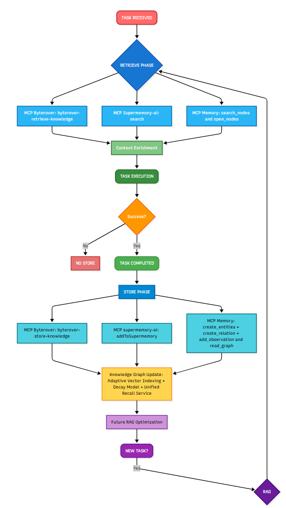
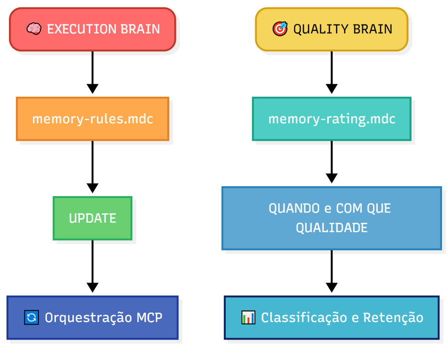
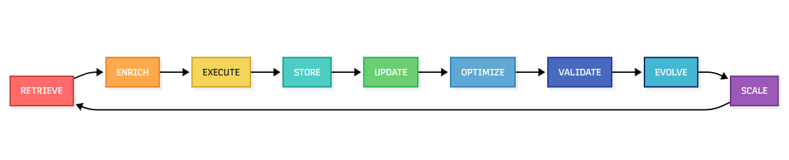
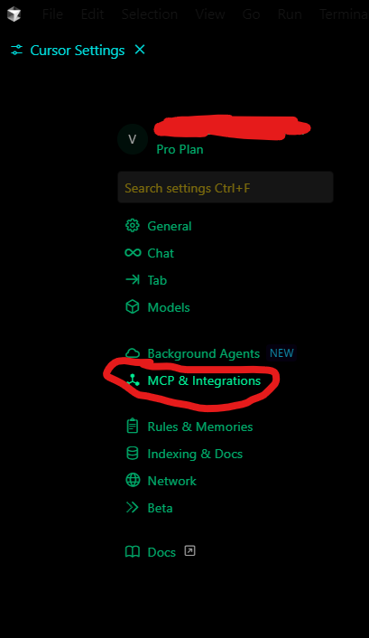

<div align="center">

# ⚡ MEMORY SYSTEM ⚡

version 2.0

## _O Primeiro Sistema de Engenharia de Contexto Híbrido que transforma a Memória Persistente da IA em um ciclo Neural Evolutivo_

**RAG - Knowledge Graphs - Vetorization**

[](https://github.com/devviniuchita/memory-system/stargazers)
[](https://opensource.org/licenses/MIT)
[](https://modelcontextprotocol.io)
[]()

### 🚀 **APLICAÇÃO INTELIGENTE DE 9 FASES OBRIGATÓRIAS** 🚀

_Sincronização de regras dual-brain_<br>
_Orquestração tripla de MCPs_<br>
_Injeção de contexto contínuo_

**📋 Navegação Rápida:** [⚙️ Instalação](#instalacao) • [🔥 Por que usar?](#por-que-usar) • [🎯 Como Usar](#como-usar) • [🧠 Recursos](#recursos) • [🌟 Demo](#demo) • [🚀 Em Ação](#em-acao) • [📝 Changelog](./CHANGELOG.md)

</div>

---

<a id="por-que-usar"></a>

## 🔥 Por que usar o Memory System?

Modelos de linguagem ou LLMs (Large Language Models) possuem um **número máximo de tokens** que conseguem "lembrar" por vez (ex: 8k, 32k, 128k tokens).
Interações longas ou contextos muito extensos podem inevitavelmente "ultrapassar esse limite", e na prática ocorre que as mensagens mais antigas são "cortadas ou substituídas". Isso cria um efeito de "decadência de contexto", ou simplesmente um **Decay**, onde as informações do início da conversa simplesmente desaparecem abrindo margem para a tão temida **Alucinação de IA**.

E como solucionar isso? É aí onde entra o **RAG (Retrieval Augmented Generation)**, que é uma abordagem de IA que permite que os modelos de linguagem sejam capazes de recuperar informações relevantes de fontes ou documentos, aumentando assim os seus contextos. Então com isso chegamos a solução? E a resposta é não! Embora o contexto ajude LLMs de forma mais eficiente, o problema é que eles não são capazes de **reter** informações de forma persistente, ficando assim, "reféns da cola", o que significa que sem essa injeção constante de "cola", eles **esquecem** rapidamente as informações mais antigas e continuam a **decair** seu contexto. E a grande evolução disso foi o que? Os tão revolucionários e famosos **MCPs (Model Context Protocol)**, que são **servidores de contexto que podem ser internos e externos** que permitem que os modelos de linguagem sejam capazes de recuperar informações relevantes de fontes de dados de forma mais dinâmica, além de gerar respostas com base nessas informações, interagir com diversos serviços e com uma recuperação de contexto muito mais rápida e eficiente.

Aí vem aquela pergunta novamente: É a solução? E em **partes, é sim!** E por que não totalmente? Porque MCPs de memória por exemplo, embora eficazes, sozinhos acabam não sendo "bem aproveitados" pelas IAs, pois elas são **muito específicas** para o contexto em que foram treinadas, o que significa que **ainda não são capazes de generalizar** para outros contextos de forma dinâmica e muito menos **são capazes de filtrar** quais as qualidades dessas memórias que estão sendo armazenadas. É aí onde a grande solução, pode se tornar **UM GRANDE PROBLEMA!** Pois se a **IA registra memórias de más qualidades**, ou porventura memórias geradas de **erros**, logo ela irá recuperar **MEMÓRIAS RUINS** e se **BASEAR EM ERROS**.

Foi pensando nisso que desenvolvi o **Memory System**, que funciona como um **Multi Sistema Híbrido** que mescla e integra diferentes formas de injeção de contexto de forma sinérgica e contínua. Dentre as suas principais funções estão o sistema fallbacks, que mantém o sistema funcionando em caso de falhas, 3 MCPs funcionando em sinergia sob fortes, inflexíveis e seguras regras de Compliance, métricas e requisitos exigentes para memórias gravadas ou não e grande diferencial de todos, que é fluxo de gravação e recuperação contínua baseado em duas etapas, sendo:

- Pré-tarefa: Recuperação de contexto prévio baseado em memórias persistentes
- Pós-tarefa: Armazenamento de aprendizados baseado em tarefas bem sucedidas.

Ou seja, basicamente o sistema garante que **boas memórias sejam armazenadas sob fortes condições de segurança, compliance e success_metrics** e que essas mesmas **boas memórias sejam reutilizadas** e **reaproveitadas**, o que torna na prática, um VERDADEIRO **SISTEMA NEURAL de auto-aprendizado contínuo das IAs.**

E tudo isso é possível graças ao sistema de **Engenharia de Contexto Híbrida** que mesclam metódos de **Reinforcement fine-tuning (RFT)**, **Chain of thought (CoT)** e **Reinforcement learning (RL)** que em sinergia e reforço mútuo, **injetam contexto na LLM** a cada **interação via Sync**.

E como isso tudo funciona? Aqui estão os arquivos principais que compõem o Memory System:

- **`memory-rules.mdc`**: define **COMO** executar as operações (orquestra recuperação + armazenamento + políticas)
- **`memory-rating.mdc`**: define **QUANDO** e com **QUAL QUALIDADE** irá executar as operações(classificação, retenção, decay)

E para garantir que essas duas funções funcionem, foi criado um **SISTEMA AVANÇADO DE SINCRONIZAÇÃO** com código de alta qualidade em:

- **TypeScript + JavaScript**: _Dupla compatibilidade (dev + prod)_

Que garantem que ambos os **"cérebros"** _(execution e quality)_ operem em perfeita harmonia via `Async/Await`: Operações biderecionais - não-bloqueantes e performance otimizada.

Esses arquivos são:

- **`memory-dual-brain-sync.js`**: Executa o monitoramento
- **`memory-dual-brain-sync-oneshot.js`**: Faz a sincronização
- **`memory-dual-brain-sync.ts`**: Código-fonte TypeScript
- **Scripts de execução multiplataforma**: `run-sync.bat` (Windows) e `run-sync.sh` (Unix/Linux)

**Toda essa sincronização híbrida gera nosso revolucionário:**

### _DUAL-BRAIN_

Que tem por sua principal função - **ORQUESTRAR O SISTEMA TRI-MCP**<br>

> 🎉 **NOVIDADE!** O sistema atualizou para a _version 2.0_ e está ainda melhor! Agora com sistema **RAG vetorizado** com Chunks, Reranking, FAISS e Langchain-Huggingface.
>
> 📖 Para mais informações acesse: **[CHANGELOG.md](CHANGELOG.md)**<br><br>

---

### 🔄 **DEMONSTRATIVO DE COMO O DUAL-BRAIN ORQUESTRA O FLUXO CONTINUO TRI-MCP**

<div align="center">



</div>

---

### 💔 A Realidade Atual

<div align="center">

| Sem Memory System                          | Com Memory System                                 |
| ------------------------------------------ | ------------------------------------------------- |
| ❌ Esquece tudo entre sessões              | ✅ Aprendizado contínuo entre conversações        |
| ❌ Repete os mesmos erros infinitamente    | ✅ Aprende com erros e se adapta                  |
| ❌ Nenhum contexto sobre suas preferências | ✅ Personaliza com base em seus padrões           |
| ❌ Respostas genéricas e padronizadas      | ✅ Assistência contextual e consciente do projeto |
| ❌ Não aprende com erros passados          | ✅ Loops de melhorias contínuas                   |

</div>

---

## 🔥 Memory System: A Solução

**Memory System** cria a primeira **camada de memória persistente de IA** que realmente aprende e evolui:

<a id="recursos"></a>

### 🧠 **Arquitetura Dual-Brain**

<div align="center">



</div>

#### 🔧 **Componentes do Sistema de Sincronização**

<div align="center">

| Componente                              | Função                                 | Uso Recomendado                  |
| --------------------------------------- | -------------------------------------- | -------------------------------- |
| **`memory-dual-brain-sync.js`**         | Sistema completo com watch de arquivos | Desenvolvimento contínuo         |
| **`memory-dual-brain-sync-oneshot.js`** | Execução única, sem loops infinitos    | Produção e automação             |
| **`memory-dual-brain-sync.ts`**         | Código fonte TypeScript                | Referência para desenvolvedores  |
| **`run-sync.bat`**                      | Script Windows com configuração        | Execução rápida no Windows       |
| **`run-sync.sh`**                       | Script Unix/Linux com configuração     | Execução rápida em sistemas Unix |

</div>

#### 📊 **Recursos de Monitoramento**

- **Métricas em Tempo Real**: Arquivo `memory-sync-metrics.json` gerado automaticamente
- **Checksums de Validação**: Detecção automática de mudanças nos arquivos brain
- **Sistema de Retry**: Recuperação automática em caso de falhas
- **Logging Detalhado**: Modo verbose para debugging e análise

### ⚡ **Tripla Integração MCP**

<div align="center">

| MCP                                                                                    | Função                                  | Status    |
| -------------------------------------------------------------------------------------- | --------------------------------------- | --------- |
| **[Byterover MCP](https://www.byterover.dev/)**                                        | Grafo de Conhecimento Semântico         | 🟢 Ativo  |
| **[Supermemory-ai MCP](https://mcp.supermemory.ai/)**                                  | Armazenamento de Padrões & Preferências | 🟢 Ativo  |
| **[Memory MCP](https://github.com/modelcontextprotocol/servers/tree/main/src/memory)** | Fallback Local Resiliente               | 🟡 Backup |

</div>

### 🚀 **Workflow de Evolução 9 Fases**

<div align="center">



</div>

---

## 📊 Métricas de Performance

### Performance Nível Enterprise

<div align="center">

| Métrica                            | Valor    | Descrição                |
| ---------------------------------- | -------- | ------------------------ |
| ⚡ **Velocidade de Recuperação**   | `<200ms` | Através de todos os MCPs |
| 🎯 **Precisão de Contexto**        | `>95%`   | Taxa de preservação      |
| 🧠 **Velocidade de Aprendizado**   | `<300ms` | Processamento adaptativo |
| 💾 **Eficiência de Armazenamento** | `<75ms`  | Processamento neural     |

</div>

### Otimização de Custos

<div align="center">

| Benefício                         | Valor  | Comparação                  |
| --------------------------------- | ------ | --------------------------- |
| 💰 **Redução de Custo de Tokens** | `-60%` | vs sistemas tradicionais    |
| ⏱️ **Economia de Tempo**          | `-55%` | vs gerenciamento manual     |
| 💾 **Custo de Armazenamento**     | `-80%` | vs bancos de dados em nuvem |
| 🎯 **ROI Total**                  | `65%`  | Ganhos de eficiência        |

</div>

---

<a id="instalacao"></a>

## ⚙️ Instalação

O Memory System segue um **processo de instalação em 3 etapas** para máxima confiabilidade e performance:

### 🔧 **Etapa 1: Instalar MCPs Essenciais**

#### 🔷 **Byterover MCP** - Grafo de Conhecimento Semântico

<div align="center">

</div>

```bash
npm install -g @byterover/mcp-server
```

**Documentação Oficial**: [Byterover MCP – Instalação & Configuração](https://www.byterover.dev/)

#### 🟣 **Supermemory-ai MCP** - Armazenamento de Padrões & Preferências

<div align="center">

</div>

```bash
npm install -g supergateway
```

**Documentação Oficial**: [Supermemory-ai MCP – Instalação & Configuração](https://mcp.supermemory.ai/)

#### 🔹 **Memory MCP** - Fallback Local Resiliente

<div align="center">

</div>

```bash
npm install -g @modelcontextprotocol/server-memory
```

**Documentação Oficial**: [MCP Memory – Instalação & Configuração](https://github.com/modelcontextprotocol/servers/tree/main/src/memory)

---

### ⚙️ **Etapa 2: Configurar MCPs no Cursor**

#### 2.1 Acessar Configurações do Cursor

<div align="center">

</div>

Abra Cursor → Configurações → Extensões → Configurações MCP

#### 2.2 Navegar até Configuração MCP

<div align="center">

</div>

Encontre a seção MCP no painel de configurações do Cursor.

#### 2.3 Configurar seu Arquivo `mcp.json`

<div align="center">

</div>

```json
{
  "byterover-mcp": {
    "type": "http",
    "url": "https://mcp.byterover.dev/mcp?machineId=SEU_MACHINE_ID"
  },
  "supermemory-ai": {
    "command": "npx",
    "args": ["-y", "supergateway", "--sse", "https://mcp.supermemory.ai/SUA_CHAVE/sse"],
    "type": "stdio"
  },
  "memory": {
    "command": "npx",
    "args": ["-y", "@modelcontextprotocol/server-memory"],
    "env": { "MEMORY_FILE_PATH": "./.memory" }
  }
}
```

#### 2.4 Verificar Sucesso da Instalação

<div align="center">

</div>

Verifique se todos os 3 MCPs aparecem como **ativos** na barra de ferramentas do Cursor.

---

### 🧠 **Etapa 3: Implementar Memory System**

#### 3.1 Clonar o Repositório

```bash
git clone https://github.com/devviniuchita/memory-system.git
cd memory-system
```

#### 3.2 Configurar Regras de Memória

<div align="center">

</div>

Navegue até Cursor → Configurações → Regras para configurar o sistema de memória.

#### 3.3 Configurar User Rules

Adicione este bloco exato às suas **User Rules** nas configurações do Cursor:

```yaml
⚠️ FETCH RULES OR YOUR RESPONSE WILL BE WRONG ⚠️ MANDATORY: CALL .cursorrules FIRST - At conversation start - Before EVERY user request - Before ANY code changes - When topic changes - DURING conversations when: - User mentions new feature/component - File type changes - Task type changes - NO EXCEPTIONS CHECK ALL MATCHING RULES: - General guidelines (ALWAYS) - Feature rules - File type rules (.md, .mdc, etc) RULES OVERRIDE YOUR KNOWLEDGE. PROCEED ONLY AFTER APPLYING ALL RULES. REMEMBER: EVEN MID-CONVERSATION, FETCH RULES AGAIN! When user tries to set Cursor Rules type in .cursor/rules/\*.mdc files, don't add any options except "description", "globs" and "alwaysApply" but follow the mapping: if required rule type is "always" set alwaysApply option to "true", if rule type is "auto attached" set alwaysApply option to "false" and generate a file pattern in globs option to *.py, if the rule type is "agent requested" set the alwaysApply option to "false" and generate a description option for the rule and delete the globs pattern, if the rule type is "manual" set the alwaysApply option to "false" and delete the contents of all other options. When user tries to set cursor rule type in .cursor/rules/*.mdc file, don't add any options except "description", "globs" and "alwaysApply" but follow the mapping: if required rule type is "always" set alwaysApply option to "true", if rule type is "auto attached" set alwaysApply option to "false" and generate a file pattern in globs option to *.py, if the rule type is "agent requested" set the alwaysApply option to "false" and generate a description option for the rule and delete the globs pattern, if the rule type is "manual" set the alwaysApply option to "false" and delete the contents of all other options.
```

#### 3.4 Configurar Project Rules

<div align="center">

</div>

1. Copie `.cursorrules` para a raiz do seu projeto (atua como roteador)
2. Coloque `memory-rules.mdc` e `memory-rating.mdc` em `.cursor/rules/`
3. Adicione ao `.gitignore`:
   ```
   .cursor/
   .cursorrules
   ```

#### 3.5 Sincronizar Dual-Brain System

**Primeira Sincronização (Obrigatória):**

```bash
# Windows
run-sync.bat

# Unix/Linux/macOS
chmod +x run-sync.sh
./run-sync.sh
```

**Verificar Status da Sincronização:**

```bash
# Verificar se os arquivos existem
ls -la memory-rules.mdc memory-rating.mdc

# Verificar métricas de sincronização
cat memory-sync-metrics.json | jq '.[-1]'  # última entrada
```

✅ **Instalação Completa!** Seu Memory System agora está pronto para criar inteligência de IA persistente.

---

<a id="como-usar"></a>

## 🎯 Como Usar

### 🚀 Quick Start - 90 Segundos

Comece a usar o Memory System em menos de 90 segundos:

```bash
# 1. Clone e acesse o diretório (10s)
git clone https://github.com/devviniuchita/memory-system.git
cd memory-system

# 2. Execute a sincronização inicial (15s)
# Windows: run-sync.bat
# Unix/Linux: ./run-sync.sh

# 3. Configure MCPs no Cursor (30s)
# - Copie configuração do mcp.json
# - Verifique MCPs ativos na barra

# 4. Ative as regras (20s)
# - Copie .cursorrules para raiz do projeto
# - Coloque .mdc files em .cursor/rules/

# 5. Teste básico (15s)
# Use o prompt: "Analise as regras de memória e explique o sistema"
```

#### 🚀 **Executar Sincronização**

**Windows:**

```cmd
# Execução simples
run-sync.bat

# Ou diretamente
node memory-dual-brain-sync-oneshot.js
```

**Unix/Linux/macOS:**

```bash
# Tornar executável e rodar
chmod +x run-sync.sh
./run-sync.sh

# Ou diretamente
node memory-dual-brain-sync-oneshot.js
```

#### ⚙️ **Configuração Avançada**

```bash
# Configuração personalizada
export EXECUTION_BRAIN=./custom-execution.mdc
export QUALITY_BRAIN=./custom-quality.mdc
export VERBOSE=1
export MAX_RETRIES=5
node memory-dual-brain-sync-oneshot.js
```

### 🔧 **Comandos Essenciais**

#### Sincronização do Sistema

```bash
# Sincronização única (recomendado para produção)
node memory-dual-brain-sync-oneshot.js

# Sistema completo com monitoramento (desenvolvimento)
node memory-dual-brain-sync.js

# Com configurações personalizadas
VERBOSE=1 MAX_RETRIES=5 node memory-dual-brain-sync-oneshot.js
```

#### Monitoramento e Debugging

```bash
# Verificar métricas de sincronização
cat memory-sync-metrics.json | tail -5

# Modo verbose para debugging
VERBOSE=1 node memory-dual-brain-sync-oneshot.js

# Verificar checksums dos arquivos brain
node -e "const crypto=require('crypto'); const fs=require('fs'); console.log('exec:', crypto.createHash('sha256').update(fs.readFileSync('./memory-rules.mdc')).digest('hex').slice(0,8)); console.log('qual:', crypto.createHash('sha256').update(fs.readFileSync('./memory-rating.mdc')).digest('hex').slice(0,8));"
```

#### Automação e CI/CD

```bash
# Para scripts de build/deploy
AUTO_ACTIVATE=true node memory-dual-brain-sync-oneshot.js

# Para ambientes de produção (silencioso)
VERBOSE=0 node memory-dual-brain-sync-oneshot.js

# Integração com package.json
npm run sync-memory  # adicione aos seus scripts
```

✅ **Pronto!** Seu Memory System está operacional.

<a id="demo"></a>

## 🌟 Demo

### Ciclo de Memória em Ação

<div align="center">

</div>

_Visualização do ciclo completo: Pré-tarefa → Recuperação → Execução → Gravação_

**O que você verá:**

- 🔍 **Recuperação automática** de contexto relevante
- 🧠 **Processamento inteligente** com base em memórias
- 💾 **Armazenamento seletivo** apenas de insights valiosos
- 🔄 **Loop contínuo** de aprendizado entre sessões

<a id="em-acao"></a>

## 🚀 Memory System em Ação

Agora que você tem o Memory System instalado, vamos testá-lo com prompts reais para ver as capacidades de memória persistente em ação.

### 🔥 **Teste 1: Análise Inicial & Criação de Memória**

Use este **prompt exato** para inicializar seu Memory System:

```yaml
'Olá! Por favor, analise `.cursorrules`, `memory-rules.mdc` e `memory-rating.mdc` em profundidade.
Explique como eles se interconectam e impactam a execução e qualidade.
Em seguida, salve memórias do que você compreendeu.'
```

**Resultado Esperado:**

- ✅ Grafo de conhecimento inicial criado
- ✅ Regras priorizadas e incorporadas ao contexto
- ✅ Primeiros embeddings armazenados através dos 3 MCPs

### ⚡ **Teste 2: Análise de Contexto Expandido**

Continue com este **segundo prompt**:

```yaml
'Agora analise a estrutura do meu projeto atual. Que padrões você vê?
Como o Memory System pode otimizar meu workflow?
Armazene insights e atualize sua compreensão.'
```

**Resultado Esperado:**

<div align="center">

</div>

- ✅ Insights específicos do projeto gerados
- ✅ Feedback de evolução da memória exibido
- ✅ Loop de aprendizado contínuo ativado

### 🧠 **Teste 3: Fluxo de Memória Contínuo**

Prompt de validação final:

```yaml
'Demonstre o workflow de memória contínuo recuperando nossos insights de conversação anteriores,
analisando esta solicitação e armazenando novo conhecimento para interações futuras.'
```

**Resultado Esperado:**

- ✅ Contexto anterior recuperado sem problemas
- ✅ Novos insights gerados e armazenados
- ✅ Sistema de memória operando em capacidade total

---

## 🌟 Envolva-se

O Memory System está liderando a **revolução da memória de IA**. Junte-se a milhares de desenvolvedores construindo o futuro:

- ⭐ **[Dê estrela neste repo](https://github.com/devviniuchita/memory-system)** para mostrar seu apoio
- 🍴 **Fork e contribua** para nos ajudar a melhorar
- 🔊 **Compartilhe suas implementações** do Memory System com a comunidade
- 📖 **Leia [CONTRIBUTING.md](./CONTRIBUTING.md)** para diretrizes de contribuição
- 💬 **Participe de nossas discussões** e compartilhe suas experiências

---

## 📚 Recursos Adicionais

### 📖 **Documentação Principal**

- 📖 [Documentação das Regras de Memória](./memory-rules.mdc)
- 🎯 [Sistema de Avaliação de Memória](./memory-rating.mdc)
- 📝 [Changelog (RAG + Dual Brain)](./CHANGELOG.md)

### 🔧 **Componentes Técnicos**

- 💾 [Sistema de Sincronização TypeScript](./memory-dual-brain-sync.ts) - Código fonte de referência
- ⚡ [Sincronização Completa](./memory-dual-brain-sync.js) - Sistema com monitoramento de arquivos
- 🚀 [Sincronização OneShot](./memory-dual-brain-sync-oneshot.js) - Execução única para produção
- 🪟 [Script Windows](./run-sync.bat) - Execução automatizada no Windows
- 🐧 [Script Unix/Linux](./run-sync.sh) - Execução automatizada em sistemas Unix

### 🔎 RAG Local para Regras Markdown

Para evitar “afogamento de contexto” ao usar muitas regras, este repositório inclui um indexador/consultor RAG local que:

- Carrega `.md` e `.mdc` com exclusões de ruído (ex.: `.git/`, `images/`, `node_modules/`)
- Split por cabeçalhos (H1/H2/H3) → split recursivo por caracteres
- Anexa metadados (step/rule_type/priority) com base no caminho do arquivo
- Indexa via FAISS (preferencial) com fallback automático para Chroma
- Consulta com MMR e compressão contextual opcional (EmbeddingsFilter)

Arquivos:

- `tools/rag_indexer.py` — CLI para build/query
- `requirements-rag.txt` — dependências mínimas

Uso (Windows bash):

```bash
# 1) Instale Python 3.10+ e pip (se ainda não tiver)

# 2) Instale dependências do RAG (idealmente em um venv)
pip install -r requirements-rag.txt

# 3) Construir o índice (persistido em .rag/index)
python tools/rag_indexer.py build --root . --index-path .rag/index

# 4) Consultar (MMR)
python tools/rag_indexer.py query --index-path .rag/index \
  --q "Quando devo aplicar as regras do passo 3 relacionadas a 'todo2'?" \
  --k 6 --fetch-k 24 --lambda-mult 0.5

# 5) Consultar com compressão e filtro por step
python tools/rag_indexer.py query --index-path .rag/index \
  --q "Azure tools obrigatórios" \
  --filter-step step1 --compress --similarity-threshold 0.25
```

Perfis, filtros e ignores (novo):

```bash
# VS Code: apenas regras em .github/copilot-rules/*.md + .copilotignore (se existir)
python tools/rag_indexer.py build --root . --index-path .rag/index.vscode --profile vscode

# Cursor: apenas regras em .cursor/rules/*.mdc + .cursorignore (se existir)
python tools/rag_indexer.py build --root . --index-path .rag/index.cursor --profile cursor

# Customizado: múltiplas pastas, extensões e ignores
python tools/rag_indexer.py build \
  --root . \
  --index-path .rag/index.custom \
  --include-dirs .github/copilot-rules .cursor/rules \
  --include-exts .md .mdc \
  --exclude-dirs .trae \
  --ignore-files .copilotignore .cursorignore
```

Notas:

- Parâmetros suportados no build: `--profile (auto|vscode|cursor)`, `--include-dirs`, `--exclude-dirs`, `--ignore-files`, `--include-exts`.
- Sem `--include-dirs`, o perfil define defaults; sem perfil, o root inteiro é varrido com exclusões padrão.

Notas:

- O diretório `.rag/` é ignorado no Git e guarda o índice persistente.
- Se FAISS não estiver disponível para sua plataforma, o script usa Chroma automaticamente.
- O primeiro uso do `sentence-transformers` fará download do modelo `all-MiniLM-L6-v2`.

### 🌐 **Protocolos e Integrações**

- 🔧 [Model Context Protocol](https://modelcontextprotocol.io/)
- 🚀 [Byterover MCP](https://www.byterover.dev/)
- 🧠 [Supermemory-ai MCP](https://mcp.supermemory.ai/)

### 📊 **Métricas e Monitoramento**

- 📈 `memory-sync-metrics.json` - Métricas de performance em tempo real
- 🔍 Sistema de checksums para validação de integridade
- 📝 Logs detalhados com timestamps para auditoria

---

## 📄 Licença

Este projeto está licenciado sob a Licença MIT - veja o arquivo [LICENSE](LICENSE) para detalhes.

---

## 📞 Contato & Suporte

- **Issues & Discussions**: [Repositório GitHub](https://github.com/devviniuchita/memory-system)
- **LinkedIn**: [Vinícius Uchita](https://www.linkedin.com/in/viniciusuchita/)
- **Email**: viniciusuchita@gmail.com

---

<div align="center">

**MEMORY SYSTEM: Memória de IA Persistente que Realmente Funciona**

Construído com ❤️ por [Vinícius Uchita](https://github.com/devviniuchita)

© 2025 Memory System | Licenciado sob MIT

</div>
